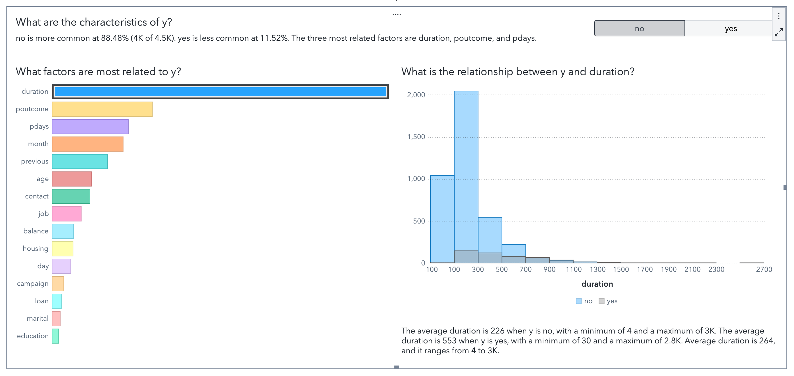
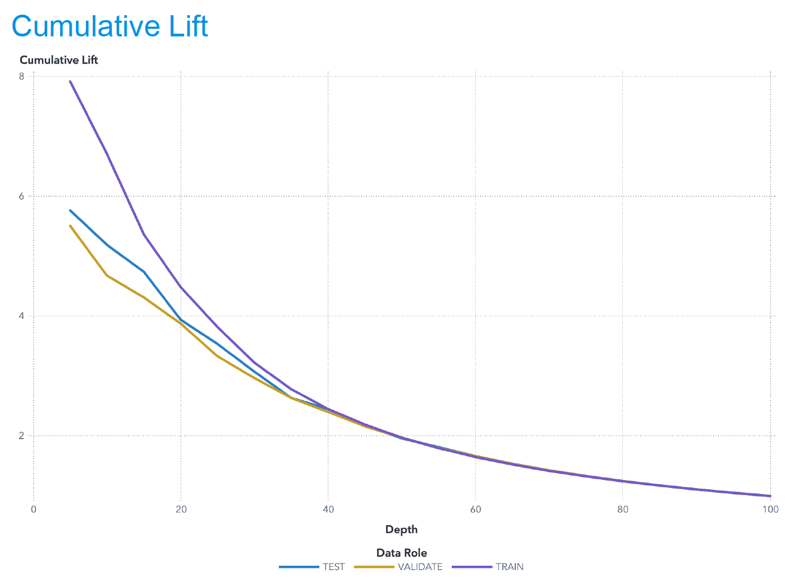

📘 Bank Marketing Campaign Optimization using SAS Viya
Predicting Term Deposit Subscriptions with Advanced Machine Learning Models

This project applies advanced machine learning techniques in SAS Viya to optimize direct marketing campaigns conducted by a Portuguese bank. Using customer demographics, financial attributes, and campaign engagement data, the goal is to predict which customers are most likely to subscribe to a term deposit, enabling smarter, cost-efficient targeting.

🚀 Project Overview

Direct marketing calls are expensive and often poorly targeted. This project builds a predictive modeling pipeline to identify high-likelihood subscribers using machine learning, allowing marketers to significantly improve conversion efficiency.

🧠 Modeling Pipeline in SAS Viya

Below is the complete modeling pipeline built in SAS Viya Model Studio — from data preparation to champion model selection:

📌 Replace with your exported pipeline image

📊 Dataset Summary

Source: UCI Machine Learning Repository — Bank Marketing Dataset

Records: 4,521

Features: 16 input variables + 1 target variable (y: subscription yes/no)

Type: Demographic, financial, campaign interaction, past outcome

Target Variable

y = yes/no → whether the customer subscribed to a term deposit.

🔍 Exploratory Data Analysis (EDA)

A few key patterns emerged during EDA:

Subscription rate is only 11–12% → Imbalanced dataset.

Longer call durations have significantly higher conversion rates.

Job type, education level, and contact month heavily influence success.

Most customers were contacted for the first time (pdays = -1).

🏗️ Machine Learning Models Developed

A total of 7 models were built and evaluated:

Forward Logistic Regression

Stepwise Logistic Regression

Decision Tree

Random Forest

Neural Network

Gradient Boosting

Ensemble Model

Data Preparation

Feature selection using cumulative variance

Log transformation of skewed attributes

Standardization (mean=0, var=1)

60/30/10 train-validation-test split

🏆 Champion Model: Gradient Boosting

Gradient Boosting outperformed all other methods.

Metric	Result
AUC	~0.92
KS Statistic	0.73
Lift @ Top 10%	~5×
Accuracy	~90%

Targeting only the top 10% of predicted customers captures ~50% of subscribers, dramatically reducing wasted calls.

📌 Replace with your Lift Chart for Gradient Boosting

💼 Business Impact

This model helps financial institutions:

Reduce marketing costs

Improve call-campaign ROI

Boost customer conversion rates

Prioritize high-likelihood customers

Implement data-driven decision making

By focusing on predictive insights, banks can shift from mass outreach → precision targeting.

🗂️ Repository Structure
📁 Bank-Marketing-SASViya-ML
│
├── README.md
├── presentation.pdf
│
├── 📁 visuals/
      ├── heatmap_age_balance.png
      ├── job_distribution.png
      └── lift_gradient_boosting.png

🔗 LinkedIn Post

https://www.linkedin.com/posts/akant-bhola_predictive-modeling-in-sas-viya-bank-marketing-activity-7371598798843805696-xE9e?utm_source=share&utm_medium=member_desktop&rcm=ACoAACEdJZwBukZ4sN0azLCGHrfOlC7pGihBzGg

📚 References

Moro, S., Rita, P., & Cortez, P. (2014). Bank Marketing Dataset. UCI Repository.

SAS Institute — Machine Learning Using SAS Viya.

👤 Author

Akant Bhola
Data Analyst
📧 Email: akantbhola.AB@gmail.com

🔗 LinkedIn: https://www.linkedin.com/in/akant-bhola/
